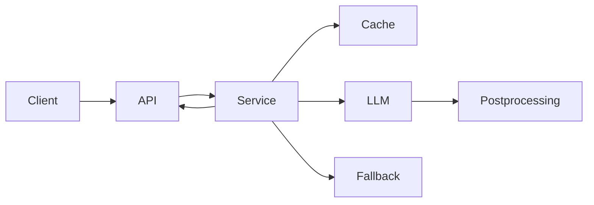

# LLM Summary Service

Production-like учебный сервис на Python и FastAPI для суммаризации пользовательского текста.

Сервис принимает текст, пытается получить краткое содержание через OpenAI и, если внешняя модель недоступна или не настроена, использует локальный fallback. Успешные ответы внешней LLM кешируются в in-memory TTL-кеше.

## Возможности

- FastAPI HTTP API.
- Валидация входных данных через Pydantic.
- Отдельный LLM-модуль на официальном OpenAI SDK.
- Бизнес-пайплайн в `SummarizationService`.
- Постобработка ответа модели.
- Timeout и retry через настройки OpenAI SDK.
- Локальный fallback без сетевых вызовов.
- Структурированные JSON-логи.
- `request_id` в JSON-ответе и заголовке `X-Request-ID`.
- In-memory TTL-кеш только для успешных LLM-ответов.
- Автоматические тесты без реальных OpenAI-запросов.
- GitHub Actions CI.
- Конфигурация через environment variables и `.env`.
- Безопасная работа с API-ключом: ключ необязателен для запуска и не выводится в ответах.

## Архитектура



- API: маршруты `GET /health` и `POST /v1/summarize`, dependency injection, логирование факта запроса.
- schemas: Pydantic-модели запроса и ответов.
- SummarizationService: бизнес-пайплайн, кеш, вызов LLM, fallback и сбор финального ответа.
- OpenAILLMClient: формирование prompt, вызов OpenAI Responses API, классификация SDK-ошибок.
- postprocessing: очистка ответа модели и проверка пустого результата.
- fallback: простая локальная суммаризация по первым предложениям.
- TTLCache: process-local TTL-кеш успешных LLM-ответов.
- config: централизованная загрузка настроек из env и `.env`.
- logging: JSON-формат логов и контекстный `request_id`.

API-роут не содержит LLM-логику, правила кеширования или fallback-алгоритм.

## Структура репозитория

```text
.
├── app/
│   ├── api/
│   │   └── routes.py
│   ├── core/
│   │   ├── config.py
│   │   └── logging.py
│   ├── llm/
│   │   └── client.py
│   ├── services/
│   │   └── summarization.py
│   ├── cache.py
│   ├── exceptions.py
│   ├── fallback.py
│   ├── main.py
│   ├── postprocessing.py
│   └── schemas.py
├── tests/
├── .github/
│   ├── workflows/
│   │   └── ci.yml
│   └── pull_request_template.md
├── .env.example
├── .gitignore
├── Makefile
├── README.md
├── TESTING.md
├── requirements.txt
└── requirements-dev.txt
```

## Требования

- Python 3.9+.
- Git.
- `curl` для ручной проверки.
- OpenAI API key нужен только для реального LLM-ответа.

Без `OPENAI_API_KEY` приложение запускается и работает в degraded-режиме через локальный fallback.

## Быстрый запуск

```bash
python3 -m venv .venv
source .venv/bin/activate
make install
cp .env.example .env
make run
```

Если нужен реальный LLM-ответ, укажите ключ в локальном `.env`:

```text
OPENAI_API_KEY=
```

Значение ключа не храните в Git и не показывайте в логах, скриншотах или терминальных выводах.

После запуска:

- API: `http://127.0.0.1:8000`
- Swagger UI: `http://127.0.0.1:8000/docs`
- ReDoc: `http://127.0.0.1:8000/redoc`

## Конфигурация

| Переменная | Назначение | Обязательность | Значение по умолчанию или пример |
|---|---|---:|---|
| `APP_NAME` | Название FastAPI-приложения | Нет | `LLM Summary Service` |
| `APP_ENV` | Имя окружения | Нет | `local` |
| `LOG_LEVEL` | Уровень логирования | Нет | `INFO` |
| `OPENAI_API_KEY` | API-ключ OpenAI | Нет | пусто; без ключа используется fallback |
| `OPENAI_MODEL` | Модель OpenAI | Нет | `gpt-4.1-mini` |
| `OPENAI_BASE_URL` | Base URL OpenAI-compatible API | Нет | `https://api.openai.com/v1` |
| `LLM_TIMEOUT_SECONDS` | Timeout LLM-запроса | Нет | `10` |
| `LLM_MAX_RETRIES` | Количество retry в OpenAI SDK | Нет | `2` |
| `LLM_MAX_OUTPUT_TOKENS` | Максимум output tokens | Нет | `512` |
| `CACHE_ENABLED` | Включение TTL-кеша | Нет | `true` |
| `CACHE_TTL_SECONDS` | TTL записи кеша в секундах | Нет | `300` |
| `CACHE_MAX_SIZE` | Максимальное число записей кеша | Нет | `1024` |
| `MAX_TEXT_LENGTH` | Максимальная длина `text` | Нет | `10000` |

`.env` не хранится в Git. `.env.example` не содержит секретов. Конфигурация централизована в `Settings`; `OPENAI_API_KEY` хранится как `SecretStr` и скрыт из строкового представления настроек.

## API

### GET /health

Если `OPENAI_API_KEY` настроен:

```json
{
  "status": "ok",
  "app_env": "local",
  "llm_configured": true
}
```

Если ключ отсутствует:

```json
{
  "status": "degraded",
  "app_env": "local",
  "llm_configured": false
}
```

Пример:

```bash
curl -i http://127.0.0.1:8000/health
```

В обоих случаях endpoint возвращает HTTP 200: сервис может работать через fallback.

### POST /v1/summarize

Запрос:

```bash
curl -i -X POST http://127.0.0.1:8000/v1/summarize \
  -H "Content-Type: application/json" \
  -d '{
    "text": "Это достаточно длинный текст для проверки сервиса суммаризации. Он содержит несколько предложений и подходит под ограничения валидации.",
    "max_sentences": 2
  }'
```

Формат успешного LLM-ответа:

```json
{
  "summary": "Краткое содержание текста.",
  "source": "llm",
  "cached": false,
  "degraded": false,
  "request_id": "uuid"
}
```

Формат cache hit:

```json
{
  "summary": "Краткое содержание текста.",
  "source": "llm",
  "cached": true,
  "degraded": false,
  "request_id": "new-uuid"
}
```

Формат fallback-ответа:

```json
{
  "summary": "Локальное краткое содержание.",
  "source": "fallback",
  "cached": false,
  "degraded": true,
  "request_id": "uuid"
}
```

Примеры выше показывают формат ответа и не являются подтверждением фактического OpenAI-вызова. Для каждого HTTP-запроса сервис создаёт новый `request_id` и возвращает его также в заголовке `X-Request-ID`.

## Валидация и HTTP-статусы

| Статус | Когда возвращается |
|---:|---|
| 200 | Успешный LLM-ответ или успешный fallback |
| 422 | Ошибка входных данных |
| 500 | Неожиданная внутренняя ошибка |
| 503 | Не сработали ни LLM, ни fallback |

Ограничения:

- `text`: обязательная строка, минимум 20 символов, максимум `MAX_TEXT_LENGTH` (по умолчанию 10000), не может состоять только из пробелов.
- `max_sentences`: целое число от 1 до 10, по умолчанию 3.

Fallback возвращает HTTP 200, потому что сервис сформировал пригодный результат. Деградация отражается через `source="fallback"` и `degraded=true`.

## Работа fallback

Fallback не обращается к сети и не использует OpenAI. Алгоритм:

1. Нормализует пробелы.
2. Делит текст на предложения по `.`, `!`, `?`.
3. Берёт первые `max_sentences` непустых предложений.
4. Если текст слишком длинный, ограничивает ответ 500 символами.
5. При обрезке добавляет `...`.

Fallback проще LLM и не гарантирует интеллектуальную суммаризацию: он не генерирует новые факты, а берёт фрагменты исходного текста.

## Кеширование

- Кешируются только успешные ответы внешней LLM.
- Fallback-ответы не кешируются.
- TTL и максимальный размер задаются через `CACHE_TTL_SECONDS` и `CACHE_MAX_SIZE`.
- Ключ учитывает нормализованный текст, `max_sentences`, модель, версию prompt и `LLM_MAX_OUTPUT_TOKENS`.
- В ключе используется SHA-256; пользовательский текст не хранится в ключе в открытом виде.
- При cache hit возвращается новый `request_id` текущего запроса.
- Кеш находится в памяти процесса и очищается при перезапуске.
- Несколько процессов приложения не разделяют общий кеш.

## Логирование

Логи пишутся в JSON-формате через стандартный `logging`. Записи содержат timestamp, level, logger, event, message и `request_id`, когда он доступен.

Логируются события HTTP-запросов, LLM, fallback и кеша. Вместо содержимого текста, prompt и ответа модели логируются длины, типы ошибок, статус провайдера и короткий префикс cache key.

Не логируются:

- API-ключ;
- Authorization header;
- полный пользовательский текст;
- полный prompt;
- полный ответ модели;
- содержимое `.env`.

## Тесты и проверки качества

```bash
make test
make lint
make format-check
make check
```

`make check` запускает:

1. `python3 -m ruff check .`
2. `python3 -m ruff format --check .`
3. `python3 -m pytest`
4. `python3 -m compileall app`

На 2026-07-13 локально подтверждено: 84 теста проходят.

## CI

В проекте настроен GitHub Actions workflow `CI`.

Он запускается на `push`, `pull_request` и `workflow_dispatch`, проверяет Python 3.9 и 3.12 и выполняет:

- `python -m pip check`;
- `python -m ruff check .`;
- `python -m ruff format --check .`;
- `python -m pytest`;
- `python -m compileall app`.

В CI используется встроенный pip cache по `requirements.txt` и `requirements-dev.txt`. `OPENAI_API_KEY` в workflow не задаётся: тесты работают без реального OpenAI API.

Workflow настроен, а локальные команды проверены. Удалённый CI будет подтверждён только после push в GitHub.

## Безопасность

- API-ключ передаётся только через env или локальный `.env`.
- `.env` находится в `.gitignore`.
- `.env.example` не содержит секрета.
- Автоматические тесты не выполняют реальных сетевых OpenAI-запросов.
- HTTP-ошибки нейтральные и не содержат stack trace, prompt или SDK-сообщений.
- Логи не содержат API-ключ, полный текст, prompt или полный ответ модели.

Это не полноценный security audit, а базовые меры безопасности для учебного production-like сервиса.

## Ограничения

- In-memory кеш не разделяется между процессами и очищается при перезапуске.
- Fallback является упрощённым алгоритмом.
- Нет постоянного хранилища.
- Нет аутентификации клиентских запросов.
- Нет rate limiting клиентских запросов.
- Нет deployment-конфигурации.
- Реальное качество суммаризации зависит от выбранной модели.
- `GET /health` проверяет конфигурацию ключа, а не выполняет сетевой health-check OpenAI.
